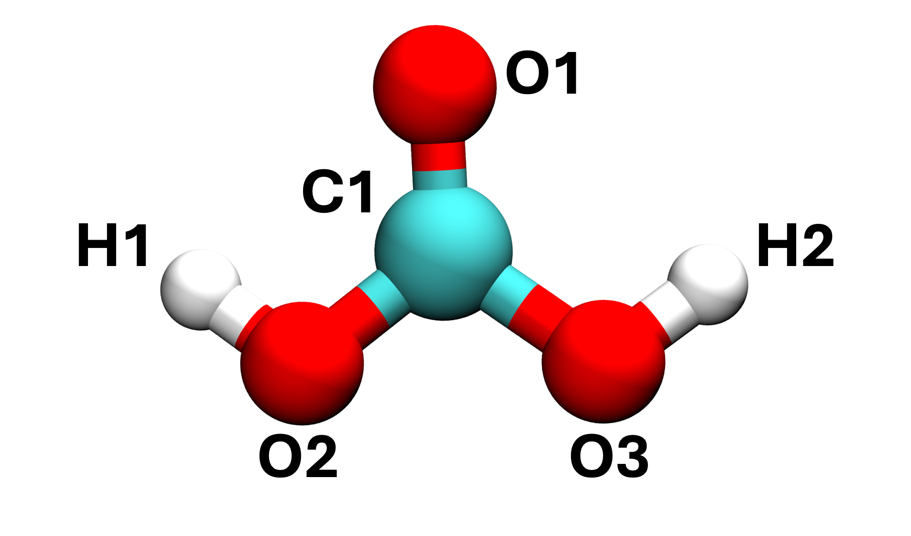
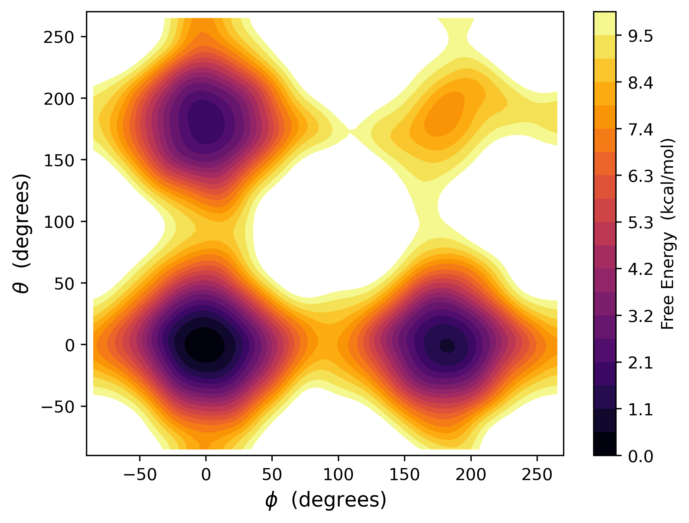

# Using MACE to run metadynamics over two collective variables

Now that we've run some simple MD, let us move on to the main task for this tutorial. In this section, we will be using PLUMED to drive a conformational change in our carbonic acid molecule. This molecule exists in three main conformations: cis-cis (CC), cis-trans (CT), and trans-trans (TT). It's up to you to determine which of these conformers is most stable, and which is least stable. 

---

Like in the previous task, we have a configuration file `init.xyz` and our ase file `mace.py`. Looking at the latter, you should see some noticeable changes to the code. The code below gives the PLUMED input needed to perform our enhanced sampling:

```python
setup = [f"UNITS LENGTH=A TIME={1/ps} ENERGY={units.mol/units.kcal}",
          "t1: TORSION ATOMS=1,6,4,5",
          "t2: TORSION ATOMS=2,3,4,5",
          "mtd: METAD ARG=t1,t2 SIGMA=0.25,0.25 HEIGHT=0.6 PACE=100 FILE=HILLS" +
                " BIASFACTOR=10 TEMP=300",
          "PRINT ARG=t1.*,t2.*,mtd.* STRIDE=100 FILE=COLVAR"]
```
Line 1 gives the units used by PLUMED. Lines 2 and 3 define the collective variables (torsion) that we will use to probe the conformation change. Line 4 is used to define the parameters used in running metadynamics, including gaussian heights, widths, and the rate at which they are deposited. Line 5 tells us to print the important collective variable information. 

For this system, we differentiate between our three conformers using two torsional collective variables, $\phi$ and $\theta$, corresponding to the H1-O2-C1-O1 and H2-O3-C1-O1 dihedrals (see below for refernce positions). When $\phi$ = $\theta$ = 0, we have the CC conformer. When $\phi$ = 0 (180) and $\theta$ = 180 (0), we have the CT conformer. And when both  $\phi$ = $\theta$ = 180, we have the TT conformer. 



Calling PLUMED during the run is achieved by the following block:
```python
init_conf.calc = Plumed(calc=calculator,
                    input=setup,
                    timestep=timestep,
                    atoms=init_conf,
                    kT=0.6)
```
where we define the MACE calculator, PLUMED input, the starting configuration, timestep, and *kT*. 

Run the simulation using `python mace.py`. Notice that two additional files will now be output alongside a trajecotry and a log file. The `COLVAR` file gives details on the values of the two collective variable at each timestep. `HILLS` records the gaussians deposited at eaech step; this will be important for reconstructing the potential energy surface later. 

We can use `COLVAR` to build up a picture of what is happening as the metadynamics proceeds. We encourage you to plot both $\phi$ and $\theta$ as a function of time to understand which states the molecule occupies and relative proportions. How many transitions have there been between CC, CT, and TT?

Following the completion of the simulation, we can now look to extract a potential energy surface for the conformational changes of carbonic acid. Copy `HILLS` to a new directory. Make sure to source your installed version of PLUMED and type `plumed sum_hills --hills HILLS --kt 0.6`. This will add up the deposited gaussians and output thte file `fes.dat`. Use this file to plot the 2D energy surface for our molecule. We have provided scripts for you to do this, though we encourage you to try coding this yourself. You should see profile that looks something like this:



We can see four basins on this profile. Are you able to identify which basin corresponds to which conformer? What is the most stable conformer? Can we provide a chemical rationale for these relative stabilities? 
