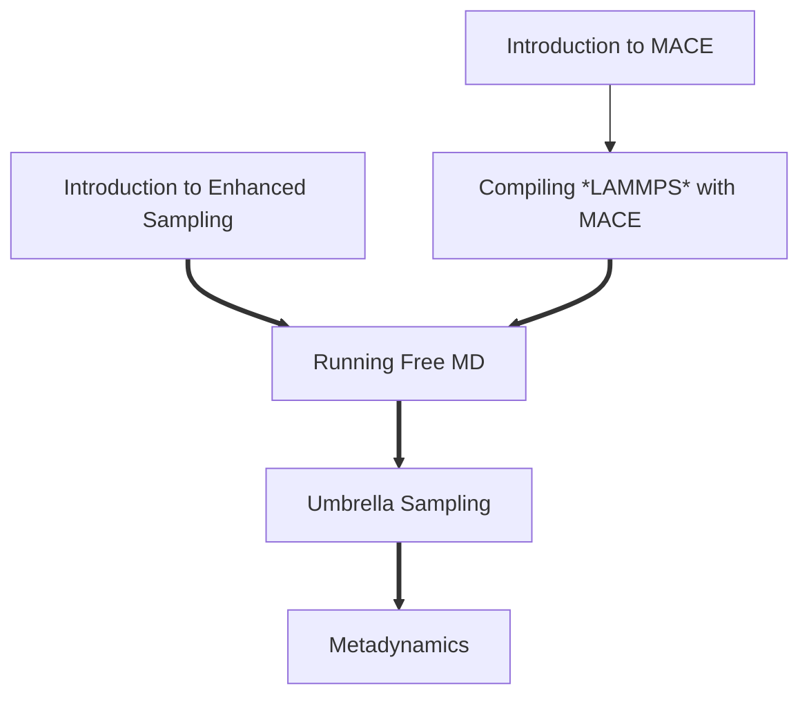

# Combining MACE with Enhanced Sampling

In this tutorial, we run through how to link up the recently developed MACE potential with PLUMED to perform enhanced sampling simulations in the form of umbrella sampling and two-dimensional metadynamics. Our test system is a molecule of carbonic acid (H2CO3) dissolved in water under ambient conditions. This tutorial will probe the various conformations carbonic acid can adopt and establish which are the most stable. 

Specifically, we run though:
- Compiling LAMMPS with both MACE and PLUMED functionality.
- Navigating the MACE-LAMMPS interface.
- Performing Umbrella Sampling using a single collective variable.
- Performing metadynamics using two collective variables.

This tutorial is organised as follows:

