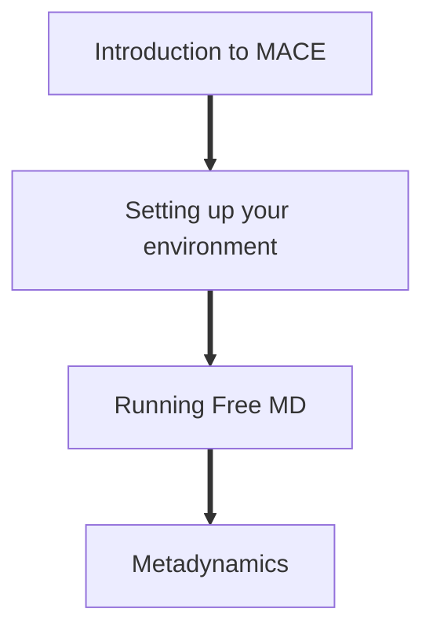

# Interfacing MACE with Enhanced Sampling

In this tutorial, we will learn how to link up the recently developed MACE potential with PLUMED to perform enhanced sampling simulations in the form of two-dimensional metadynamics. Our test system is a molecule of carbonic acid (H2CO3) dissolved in water under ambient conditions. This tutorial will probe the various conformations carbonic acid can adopt and establish which are the most stable. 

We specifically cover:
- Navigating the MACE-LAMMPS-PLUMED interface.
- Setting up your work environment.  
- Running simple MD simulations using a MACE potential. 
- Performing metadynamics using two collective variables.

By the end of this tutorial you should:
- Know how to run simple MD powered by MACE potentials.
- Integrate MACE with PLUMED to enable the accurate determination of free energy surfaces. 

This tutorial is organised as follows:

